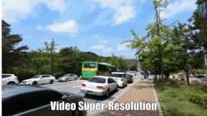
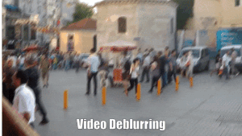
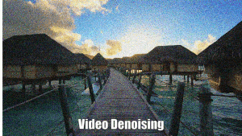
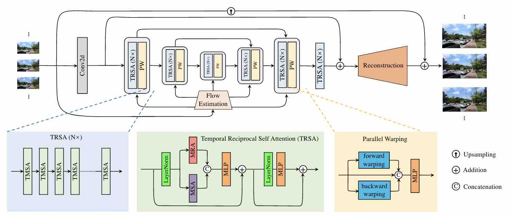

# VRT: A Video Restoration Transformer
[Jingyun Liang](https://jingyunliang.github.io), [Jiezhang Cao](https://www.jiezhangcao.com/), [Yuchen Fan](https://ychfan.github.io/), [Kai Zhang](https://cszn.github.io/), Rakesh Ranjan, [Yawei Li](https://ofsoundof.github.io/), [Radu Timofte](http://people.ee.ethz.ch/~timofter/),  [Luc Van Gool](https://scholar.google.com/citations?user=TwMib_QAAAAJ&hl=en)

Computer Vision Lab, ETH Zurich & Meta Inc.

---

[arxiv](https://arxiv.org/abs/2201.12288)
**|** 
[supplementary](https://github.com/JingyunLiang/VRT/releases/download/v0.0/VRT_supplementary.pdf)
**|** 
[pretrained models](https://github.com/JingyunLiang/VRT/releases)
**|** 
[visual results](https://github.com/JingyunLiang/VRT/releases)

[](https://arxiv.org/abs/2201.12288)
[](https://github.com/JingyunLiang/VRT)
[](https://github.com/JingyunLiang/VRT/releases)

[ <a href="https://colab.research.google.com/gist/JingyunLiang/deb335792768ad9eb73854a8efca4fe0#file-vrt-demo-on-video-restoration-ipynb"></a>](https://colab.research.google.com/gist/JingyunLiang/deb335792768ad9eb73854a8efca4fe0#file-vrt-demo-on-video-restoration-ipynb)

This repository is the official PyTorch implementation of "VRT: A Video Restoration Transformer"
([arxiv](https://arxiv.org/pdf/2108.10257.pdf), [supp](https://github.com/JingyunLiang/VRT/releases/download/v0.0/VRT_supplementary.pdf), [pretrained models](https://github.com/JingyunLiang/VRT/releases), [visual results](https://github.com/JingyunLiang/VRT/releases)). VRT ahcieves state-of-the-art performance **(up to 2.16dB)** in
- video SR (REDS, Vimeo90K, Vid4 and UDM10)
- video deblurring (GoPro, DVD and REDS)
- video denoising (DAVIS and Set8)

<p align="center">
  <a href="https://github.com/JingyunLiang/VRT/releases">
    
    
    
  </a>
</p>

:rocket:  :rocket:  :rocket: **News**:
- **Jan. 26, 2022**: See our previous works on

|   Topic   |     Title     |    Badge  |
|:---:|:------:|             :--------------------------:                     |
|  transformer-based image restoration   |   [SwinIR: Image Restoration Using Swin Transformer, ICCVW2021](https://github.com/JingyunLiang/SwinIR)   |   [](https://arxiv.org/abs/2108.10257)[](https://github.com/JingyunLiang/SwinIR)[](https://github.com/JingyunLiang/SwinIR/releases)[ <a href="https://colab.research.google.com/gist/JingyunLiang/a5e3e54bc9ef8d7bf594f6fee8208533/swinir-demo-on-real-world-image-sr.ipynb"></a>](https://colab.research.google.com/gist/JingyunLiang/a5e3e54bc9ef8d7bf594f6fee8208533/swinir-demo-on-real-world-image-sr.ipynb)   |
|   real-world image SR  |   [Designing a Practical Degradation Model for Deep Blind Image Super-Resolution, ICCV2021](https://github.com/cszn/bsrgan) |   [](https://arxiv.org/abs/2103.14006)[](https://github.com/cszn/BSRGAN)   |
|  normalizing flow-based image SR and image rescaling   |   [Hierarchical Conditional Flow: A Unified Framework for Image Super-Resolution and Image Rescaling, ICCV2021](https://github.com/JingyunLiang/HCFlow)   |  [](https://arxiv.org/abs/2108.05301)[](https://github.com/JingyunLiang/HCFlow)[](https://github.com/JingyunLiang/HCFlow/releases)[ <a href="https://colab.research.google.com/gist/JingyunLiang/cdb3fef89ebd174eaa43794accb6f59d/hcflow-demo-on-x8-face-image-sr.ipynb"></a>](https://colab.research.google.com/gist/JingyunLiang/cdb3fef89ebd174eaa43794accb6f59d/hcflow-demo-on-x8-face-image-sr.ipynb)   |
|  blind image SR   |   [Mutual Affine Network for Spatially Variant Kernel Estimation in Blind Image Super-Resolution, ICCV2021](https://github.com/JingyunLiang/MANet)  |  [](https://arxiv.org/abs/2108.05302)[](https://github.com/JingyunLiang/MANet)[](https://github.com/JingyunLiang/MANet/releases)[ <a href="https://colab.research.google.com/gist/JingyunLiang/4ed2524d6e08343710ee408a4d997e1c/manet-demo-on-spatially-variant-kernel-estimation.ipynb"></a>](https://colab.research.google.com/gist/JingyunLiang/4ed2524d6e08343710ee408a4d997e1c/manet-demo-on-spatially-variant-kernel-estimation.ipynb)   |
|  blind image SR  |  [Flow-based Kernel Prior with Application to Blind Super-Resolution, CVPR2021](https://github.com/JingyunLiang/FKP)   |  [](https://arxiv.org/abs/2103.15977)[](https://github.com/JingyunLiang/FKP)   |

---

> Video restoration (e.g., video super-resolution) aims to restore high-quality frames from low-quality frames. Different from single image restoration, video restoration generally requires to utilize temporal information from multiple adjacent but usually misaligned video frames. Existing deep methods generally tackle with this by exploiting a sliding window strategy or a recurrent architecture, which either is restricted by frame-by-frame restoration or lacks long-range modelling ability. In this paper, we propose a Video Restoration Transformer (VRT) with parallel frame prediction and long-range temporal dependency modelling abilities. More specifically, VRT is composed of multiple scales, each of which consists of two kinds of modules: temporal mutual self attention (TMSA) and parallel warping. TMSA divides the video into small clips, on which mutual attention is applied for joint motion estimation, feature alignment and feature fusion, while self-attention is used for feature extraction. To enable cross-clip interactions, the video sequence is shifted for every other layer. Besides, parallel warping is used to further fuse information from neighboring frames by parallel feature warping. Experimental results on three tasks, including video super-resolution, video deblurring and video denoising, demonstrate that VRT outperforms the state-of-the-art methods by large margins (up to 2.16 dB) on nine benchmark datasets.
<p align="center">
  
</p>

#### Contents

1. [Requirements](#Requirements)
1. [Training](#Training)
1. [Quick Testing](#Quick-Testing)
1. [Results](#Results)
1. [Citation](#Citation)
1. [License and Acknowledgement](#License-and-Acknowledgement)


## Requirements
> - Python 3.8, PyTorch >= 1.9.1
> - Requirements: see requirements.txt
> - Platforms: Ubuntu 18.04, cuda-11.1

## Quick Testing
Following commands will download [pretrained models](https://github.com/JingyunLiang/VRT/releases) and [test datasets](https://github.com/JingyunLiang/VRT/releases) **automatically** (except Vimeo-90K testing set). If out-of-memory, try to reduce `--tile` at the expense of slightly decreased performance. 

You can also try to test it on Colab[ <a href="https://colab.research.google.com/gist/JingyunLiang/deb335792768ad9eb73854a8efca4fe0#file-vrt-demo-on-video-restoration-ipynb"></a>](https://colab.research.google.com/gist/JingyunLiang/deb335792768ad9eb73854a8efca4fe0#file-vrt-demo-on-video-restoration-ipynb), but the results may be slightly different due to `--tile` difference.
```bash
# download code
git clone https://github.com/JingyunLiang/VRT
cd VRT
pip install -r requirements.txt

# 001, video sr trained on REDS (6 frames), tested on REDS4
python main_test_vrt.py --task 001_VRT_videosr_bi_REDS_6frames --folder_lq testsets/REDS4/sharp_bicubic --folder_gt testsets/REDS4/GT --tile 40 128 128 --tile_overlap 2 20 20

# 002, video sr trained on REDS (16 frames), tested on REDS4
python main_test_vrt.py --task 002_VRT_videosr_bi_REDS_16frames --folder_lq testsets/REDS4/sharp_bicubic --folder_gt testsets/REDS4/GT --tile 40 128 128 --tile_overlap 2 20 20

# 003, video sr trained on Vimeo (bicubic), tested on Vid4 and Vimeo
python main_test_vrt.py --task 003_VRT_videosr_bi_Vimeo_7frames --folder_lq testsets/Vid4/BIx4 --folder_gt testsets/Vid4/GT --tile 32 128 128 --tile_overlap 2 20 20
python main_test_vrt.py --task 003_VRT_videosr_bi_Vimeo_7frames --folder_lq testsets/vimeo90k/vimeo_septuplet_matlabLRx4/sequences --folder_gt testsets/vimeo90k/vimeo_septuplet/sequences --tile 8 0 0 --tile_overlap 0 20 20

# 004, video sr trained on Vimeo (blur-downsampling), tested on Vid4, UDM10 and Vimeo
python main_test_vrt.py --task 004_VRT_videosr_bd_Vimeo_7frames --folder_lq testsets/Vid4/BDx4 --folder_gt testsets/Vid4/GT --tile 32 128 128 --tile_overlap 2 20 20
python main_test_vrt.py --task 004_VRT_videosr_bd_Vimeo_7frames --folder_lq testsets/UDM10/BDx4 --folder_gt testsets/UDM10/GT --tile 32 128 128 --tile_overlap 2 20 20
python main_test_vrt.py --task 004_VRT_videosr_bd_Vimeo_7frames --folder_lq testsets/vimeo90k/vimeo_septuplet_BDLRx4/sequences --folder_gt testsets/vimeo90k/vimeo_septuplet/sequences --tile 8 0 0 --tile_overlap 0 20 20

# 005, video deblurring trained and tested on DVD
python main_test_vrt.py --task 005_VRT_videodeblurring_DVD --folder_lq testsets/DVD10/test_GT_blurred --folder_gt testsets/DVD10/test_GT --tile 12 256 256 --tile_overlap 2 20 20

# 006, video deblurring trained and tested on GoPro
python main_test_vrt.py --task 006_VRT_videodeblurring_GoPro --folder_lq testsets/GoPro11/test_GT_blurred --folder_gt testsets/GoPro11/test_GT --tile 18 192 192 --tile_overlap 2 20 20

# 007, video deblurring trained on REDS, tested on REDS4
python main_test_vrt.py --task 007_VRT_videodeblurring_REDS --folder_lq testsets/REDS4/blur --folder_gt testsets/REDS4/GT --tile 12 256 256 --tile_overlap 2 20 20

# 008, video denoising trained on DAVIS (noise level 0-50) and tested on Set8 and DAVIS
python main_test_vrt.py --task 008_VRT_videodenoising_DAVIS --sigma 10 --folder_lq testsets/Set8 --folder_gt testsets/Set8 --tile 12 256 256 --tile_overlap 2 20 20
python main_test_vrt.py --task 008_VRT_videodenoising_DAVIS --sigma 10  --folder_lq testsets/DAVIS-test --folder_gt testsets/DAVIS-test --tile 12 256 256 --tile_overlap 2 20 20

# test on your own datasets (an example)
python main_test_vrt.py --task 001_VRT_videosr_bi_REDS_6frames --folder_lq testsets/your/own --tile 40 128 128 --tile_overlap 2 20 20
```

**All visual results of VRT can be downloaded [here](https://github.com/JingyunLiang/VRT/releases)**.


## Training
The training and testing sets are as follows (see the [supplementary](https://github.com/JingyunLiang/VRT/releases) for a detailed introduction of all datasets). For better I/O speed, use [create_lmdb.py](https://github.com/cszn/KAIR/tree/master/scripts/data_preparation/create_lmdb.py) to convert `.png` datasets to `.lmdb` datasets.

Note: You do **NOT need** to prepare the datasets if you just want to test the model. `main_test_vrt.py` will download the testing set automaticaly.


| Task                                                          |                                                                                                                                                                                                                                    Training Set                                                                                                                                                                                                                                     |                                                                                                                                                                                                                                                                                 Testing Set                                                                                                                                                                                                                                                                                  |        Pretrained Model and Visual Results of VRT  |
|:--------------------------------------------------------------|:-----------------------------------------------------------------------------------------------------------------------------------------------------------------------------------------------------------------------------------------------------------------------------------------------------------------------------------------------------------------------------------------------------------------------------------------------------------------------------------:|:----------------------------------------------------------------------------------------------------------------------------------------------------------------------------------------------------------------------------------------------------------------------------------------------------------------------------------------------------------------------------------------------------------------------------------------------------------------------------------------------------------------------------------------------------------------------------:|    :---:      |
| video SR (setting 1, BI)                                      |                                                                                 [REDS sharp & sharp_bicubic](https://seungjunnah.github.io/Datasets/reds.html) (266 videos, 266000 frames: train + val except REDS4)   <br  /><br  /> *Use  [regroup_reds_dataset.py](https://github.com/cszn/KAIR/tree/master/scripts/data_preparation/regroup_reds_dataset.py) to regroup and rename REDS val set                                                                                 |                                                                                                                                                                                                                                                           REDS4 (4 videos, 400 frames: 000, 011, 015, 020 of REDS)                                                                                                                                                                                                                                                           | [here](https://github.com/JingyunLiang/VRT/releases) |
| video SR (setting 2 & 3, BI & BD)                             |    [Vimeo90K](http://data.csail.mit.edu/tofu/dataset/vimeo_septuplet.zip) (64612 seven-frame videos as in `sep_trainlist.txt`)  <br  /><br  /> * Use [generate_LR_Vimeo90K.m](https://github.com/cszn/KAIR/tree/master/scripts/matlab_scripts/generate_LR_Vimeo90K.m) and [generate_LR_Vimeo90K_BD.m](https://github.com/cszn/KAIR/tree/master/scripts/matlab_scripts/generate_LR_Vimeo90K_BD.m) to generate LR frames for bicubic and blur-downsampling VSR, respectively.    |                                                                       Vimeo90K-T (the rest 7824 7-frame videos) + [Vid4](https://drive.google.com/file/d/1ZuvNNLgR85TV_whJoHM7uVb-XW1y70DW/view) (4 videos) + [UDM10](https://www.terabox.com/web/share/link?surl=LMuQCVntRegfZSxn7s3hXw&path=%2Fproject%2Fpfnl) (10 videos)  <br  /><br  /> *Use [prepare_UDM10.py](https://github.com/cszn/KAIR/tree/master/scripts/data_preparation/prepare_UDM10.py) to regroup and rename the UDM10 dataset                                                                        | [here](https://github.com/JingyunLiang/VRT/releases) |
| video deblurring (setting 1, motion blur)                     |                                                                                            [DVD](http://www.cs.ubc.ca/labs/imager/tr/2017/DeepVideoDeblurring/DeepVideoDeblurring_Dataset.zip) (61 videos, 5708 frames)  <br  /><br  /> *Use [prepare_DVD.py](https://github.com/cszn/KAIR/tree/master/scripts/data_preparation/prepare_DVD.py) to regroup and rename the dataset.                                                                                             |                                                                                                                                                                              DVD (10 videos, 1000 frames)             <br  /><br  /> *Use [evaluate_video_deblurring.m](https://github.com/cszn/KAIR/tree/master/scripts/matlab_scripts/evaluate_video_deblurring.m) for final evaluation.                                                                                                                                                                              | [here](https://github.com/JingyunLiang/VRT/releases) |
| video deblurring (setting 2, motion blur)                     |                                                                                             [GoPro](http://data.cv.snu.ac.kr:8008/webdav/dataset/GOPRO/GOPRO_Large.zip) (22 videos, 2103 frames)  <br  /><br  /> *Use [prepare_GoPro_as_video.py](https://github.com/cszn/KAIR/tree/master/scripts/data_preparation/prepare_GoPro_as_video.py) to regroup and rename the dataset.                                                                                              |                                                                                                                                                                                  GoPro (11 videos, 1111 frames)  <br  /><br  /> *Use [evaluate_video_deblurring.m](https://github.com/cszn/KAIR/tree/master/scripts/matlab_scripts/evaluate_video_deblurring.m) for final evaluation.                                                                                                                                                                                   | [here](https://github.com/JingyunLiang/VRT/releases) |
| video deblurring (setting 3, motion blur)                     |                                                         [REDS sharp & blur](https://seungjunnah.github.io/Datasets/reds.html) (266 videos, 266000 frames: train & val except REDS4)   <br  /><br  /> *Use  [regroup_reds_dataset.py](https://github.com/cszn/KAIR/tree/master/scripts/data_preparation/regroup_reds_dataset.py) to regroup and rename REDS val set. Note that it shares the same HQ frames as in VSR.                                                          |                                                                                                                                                                                                                                                           REDS4 (4 videos, 400 frames: 000, 011, 015, 020 of REDS)                                                                                                                                                                                                                                                           | [here](https://github.com/JingyunLiang/VRT/releases) |
| video denoising (Gaussian noise)                              |                                                                                                                                             [DAVIS-2017](https://data.vision.ee.ethz.ch/csergi/share/davis/DAVIS-2017-Unsupervised-trainval-480p.zip) (90 videos, 6208 frames)  <br  /><br  /> *Use all files in DAVIS/JPEGImages/480p                                                                                                                                              |                                                                                                              [DAVIS-2017-test](https://github.com/JingyunLiang/VRT/releases) (30 videos) + [Set8](https://www.dropbox.com/sh/20n4cscqkqsfgoj/AABGftyJuJDwuCLGczL-fKvBa/test_sequences?dl=0&subfolder_nav_tracking=1) (8 videos: tractor, touchdown, park_joy and sunflower selected from DERF + hypersmooth, motorbike, rafting and snowboard from GOPRO_540P)                                                                                                               | [here](https://github.com/JingyunLiang/VRT/releases) |

The training code will be put in [KAIR](https://github.com/cszn/KAIR).


## Results
We achieved state-of-the-art performance on video SR, video deblurring and video denoising. Detailed results can be found in the [paper](https://arxiv.org/abs/2201.12288).

<details>
<summary>Video Super-Resolution (click me)</summary>
<p align="center">
  
  
</p>
</details>

<details>
<summary>Video Deblurring</summary>
<p align="center">
  
  
  
</p>
</details>

<details>
<summary>Video Denoising</summary>
<p align="center">
  
</p>
</details>


## Citation
    @article{liang2022vrt,
        title={VRT: A Video Restoration Transformer},
        author={Liang, Jingyun and Cao, Jiezhang and Fan, Yuchen and Zhang, Kai and Ranjan, Rakesh and Li, Yawei and Timofte, Radu and Van Gool, Luc},
        journal={arXiv preprint arXiv:2201.12288},
        year={2022}
    }


## License and Acknowledgement
This project is released under the CC-BY-NC license. We refer to codes from [KAIR](https://github.com/cszn/KAIR), [BasicSR](https://github.com/xinntao/BasicSR), [Video Swin Transformer](https://github.com/SwinTransformer/Video-Swin-Transformer) and [mmediting](https://github.com/open-mmlab/mmediting). Thanks for their awesome works. The majority of VRT is licensed under CC-BY-NC, however portions of the project are available under separate license terms: KAIR is licensed under the MIT License, BasicSR, Video Swin Transformer and mmediting are licensed under the Apache 2.0 license.
